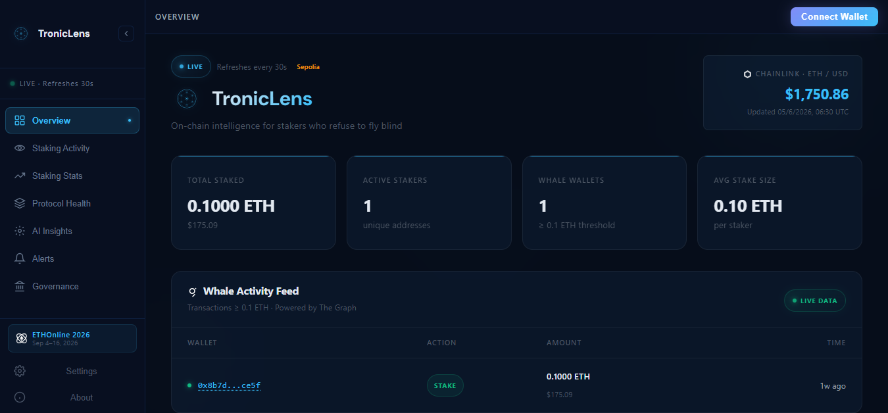
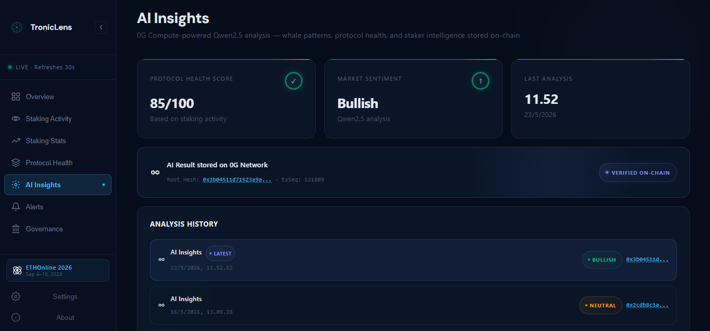
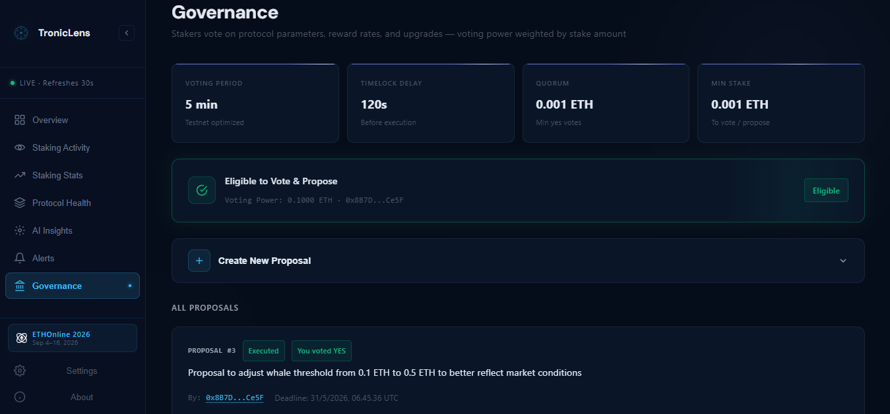

# TronicLens 

> **On-chain intelligence for stakers who refuse to fly blind**

TronicLens is a DeFi Staking Intelligence Cockpit built for **ETHOnline 2026**. It provides real-time whale activity detection, live price feeds, smart alerts, decentralized AI insights, and verifiable data archiving for ETH stakers on Sepolia.

---

## Live Demo

> **Status:** BETA Live — Sepolia PoC — Mainnet coming soon

| Resource | Link |
|----------|------|
| **Live App** | [troniclens.vercel.app](https://troniclens.vercel.app) |
| GitHub | [tronic21-ctrl/troniclens](https://github.com/tronic21-ctrl/troniclens) |
| Subgraph | [tronic-staking v0.0.2](https://api.studio.thegraph.com/query/1749265/tronic-staking/v0.0.2) |
| StorageScan | [0G Galileo Testnet](https://storagescan-galileo.0g.ai) |
| StakingContract | [0x89907e8F...06926](https://eth-sepolia.blockscout.com/address/0x89907e8F6CB6468b2c8fe2d3814249881eF06926) |

---

## Screenshots

### Overview — Real-time Staking Intelligence


### AI Insights — 0G Compute TEE Verified


### Governance — On-chain Proposal Lifecycle


## Aviation Analogy — The Cockpit Stack

---

TronicLens is built like a cockpit — every instrument serves a purpose:

| Instrument | Tech | Purpose |
|-----------|------|---------|
| Radar — Live Activity | **The Graph** | Index & query on-chain staking events |
| Altimeter — Price Feed | **Chainlink** | Real-time ETH/USD price from Sepolia oracle |
| Alert System | **Chainlink + The Graph** | Smart alerts for whale movements + ETH price |
| Black Box — Archive | **0G Storage** | Permanent decentralized snapshot of whale activity |
| AI Co-Pilot | **0G Compute** | Qwen2.5 AI analysis — TEE verified |
| Cockpit — Dashboard | **React + Vite** | Clean, real-time UI for stakers |

---

## Features

### Overview
- Real-time stat cards: Total Staked, Active Stakers, Whale Wallets, Avg Stake Size
- Chainlink ETH/USD price feed (live from Sepolia)
- Whale Activity Feed powered by The Graph

### Staking Activity
- **Whale Alert Feed** — transactions ≥ threshold ETH, powered by The Graph
- **All Transactions** — complete staking history, wallet addresses clickable → Blockscout

### Staking Stats
- Total Value Locked (TVL) with USD conversion via Chainlink
- Staker distribution: Whale vs Retail breakdown with progress bars
- ETH price via Chainlink feed
- Retail Stakers count (below threshold)

### Protocol Health
- Real-time status of all integrations:
  - StakingContract (Sepolia, verified)
  - ReentrancyGuard (OpenZeppelin v5.6.1)
  - The Graph Subgraph (tronic-staking v0.0.2, 100% synced)
  - Chainlink Feed (ETH/USD, 8 decimals, Live)
  - 0G Storage (last snapshot with clickable root hash → StorageScan)
  - GovernanceContract (Sepolia, timelock 120s)

### AI Insights
- Protocol Health Score (0–100) via Qwen2.5 on 0G Compute
- Market Sentiment analysis (Bullish / Neutral / Bearish)
- AI results stored on-chain via 0G Storage — TEE verified
- Full analysis history with clickable root hashes → StorageScan

### Smart Alerts *(New in v1.1)*
- **ETH Price Alert** — live ETH/USD from Chainlink feed with timestamp
- **Whale Activity Alerts** — transactions ≥ configurable threshold from The Graph
- **0G AI Commentary** — per-alert AI insight via 0G Compute (Qwen2.5-omni-7b)
- Summary bar: Total Alerts, Whale Alerts, ETH Price, Threshold
- No auto-refresh — stable UI so AI commentary is readable without interruption
- Powered by Vercel serverless proxy (`api/ai-commentary.js`) for secure 0G Compute calls

### Governance *(New in v1.3)*
- **On-chain Governance** — create proposals, vote (Yes/No/Abstain), execute via timelock
- **Eligibility Check** — auto-detect voting power based on stake amount
- **Real-time Countdown** — live timer untuk voting period dan timelock delay
- **Wallet Connect** — Reown AppKit integration (MetaMask, Rabby, WalletConnect, etc.)
- **Proposal History** — full proposal list dengan status badge (Active/Succeeded/Defeated/Executed)
- Minimum stake: 0.001 ETH · Voting period: 5 min · Timelock: 120s (testnet optimized)

### Staking *(New in v1.4)*
- **Stake ETH** — deposit ETH langsung ke StakingContract via UI
- **Unstake & Claim Rewards** — withdraw principal + accrued rewards sekaligus
- **Real-time position tracking** — Your Stake, Accrued Reward, Stake Duration, Min. Stake
- **Contract Reserve Monitor** — live balance contract + estimasi sustainability
- **Governance eligibility banner** — auto-detect jika user eligible untuk vote
- **Connect Wallet prompt** — clean onboarding untuk wallet baru
- Minimum stake: 0.001 ETH · Reward rate: 500 wei/detik · Sepolia Testnet

### What's New (v1.2 — May 2026)
- Fixed Simulate Whale button (correct stake() selector)
- Total Staked now shows current TVL (not historical)
- Health Score & Market Sentiment color indicators
- Clickable contract address → Blockscout
- Animated live pulse dots across all pages
- Flat badge design (reduced AI-generated feel)
- Mobile alert layout improvements
- 0G Storage upload fixed in ai-insights.mjs

### What's New (v1.3 — June 2026)
- Governance page — full on-chain proposal lifecycle (create → vote → execute)
- StakingGovernance bridge contract deployed and verified on Sepolia
- Reown AppKit wallet connect — custom branded button in topbar
- Ambient background animations per page (PageBackground component)
- Shimmer card animations consistent across all pages
- Performance optimization — reduced animation load for low-spec devices
- 0G Compute endpoint + API key updated (pc.testnet.0g.ai dashboard)
- AI commentary fully restored in Smart Alerts

### What's New (v1.4 — June 2026)
- **Staking page** — full stake/unstake UI langsung dari dashboard (tidak perlu Remix/Blockscout)
- **Contract Reserve Monitor** — live contract balance + sustainability estimator ("1000+ years")
- **Governance eligibility integration** — banner "Stake ETH to Participate" di Governance jika belum stake, dan "Go to Governance →" di Staking jika sudah eligible
- **Onboarding popup** — 7-step stepper modal untuk user baru (testnet warning, wallet setup, feature tour)
- **Pill Sepolia redesign** — white transparent pill, tidak lagi amber
- **Dev Mode removed** — Simulate Whale button dihapus dari Staking Activity (fitur staking sudah live)
- **Reward display fix** — format desimal 10 angka untuk reward kecil, duration tampil dalam hari/jam
- **StakingContract funded** — 0.01 ETH reserve + rewardRatePerSecond diset ke 500 wei/detik
- **Tombol redesign** — solid gradient buttons (Connect Wallet, Stake, Unstake, Governance) konsisten di semua halaman
- **Card consistency** — shimmer accent line hijau konsisten di semua card halaman Staking
- **Mobile layout fix** — grid 2 kolom di mobile untuk Staking cards

### Settings
- **Auto Refresh** toggle — live data from The Graph
- **Refresh Interval** selector — 15s / 30s / 60s
- **Whale Threshold** filter — 0.05 / 0.1 / 0.5 ETH
- **Compact Mode** — denser layout, real-time without reload
- **Manual Refresh** — force fetch from The Graph instantly
- **Reset to Default** — restore all settings with confirm step
- All settings persist via `localStorage`, sync globally via React Context

---

## Tech Stack

```
Frontend:       React + Vite + Framer Motion
State:          React Context (SettingsContext)
Smart Contract: Solidity ^0.8.0 + OpenZeppelin v5.6.1
Indexing:       The Graph (subgraph: tronic-staking v0.0.2)
Price Feed:     Chainlink ETH/USD (Sepolia)
Storage:        0G Storage (Galileo Testnet)
AI Compute:     0G Compute — Qwen2.5-omni-7b (TEE verified)
AI Proxy:       Vercel Serverless Function (api/ai-commentary.js)
RPC:            Alchemy (Sepolia)
Testing:        Foundry (107/107 tests pass, 98% coverage)
Deployment:     Vercel
Network:        Ethereum Sepolia Testnet
```

---

## Project Structure

```
troniclens/
├── api/
│   └── ai-commentary.js       # Vercel serverless proxy — 0G Compute CORS bypass
├── public/
│   ├── favicon.svg            # TronicLens custom favicon
│   ├── logos/                 # Brand logos (ETHGlobal, Chainlink, 0G, The Graph, etc.)
│   └── og-snapshots.json      # 0G Storage snapshot history
├── src/
│   ├── abi/
│   │   ├── StakingContract.json     # ABI StakingContract
│   │   ├── GovernanceContract.json  # ABI GovernanceContract
│   │   └── StakingGovernance.json   # ABI StakingGovernance bridge
│   ├── components/
│   │   └── Sidebar.jsx        # Collapsible navigation with live indicator
│   ├── context/
│   │   └── SettingsContext.jsx # Global settings state (React Context)
│   ├── hooks/
│   │   └── useWhaleActivity.js # The Graph + Chainlink data fetching
│   ├── pages/
│   │   ├── Dashboard.jsx      # Main router — all page sections
│   │   ├── Alerts.jsx         # Smart Alerts page (v1.1)
│   │   ├── Governance.jsx     # On-chain Governance page (v1.3)
│   │   └── StakeAction.jsx    # Staking page — stake/unstake UI (v1.4)
│   └── utils/
│       ├── colors.js          # Shared COLORS design tokens
│       └── mockData.js        # Fallback mock data
├── upload-snapshot.mjs        # 0G Storage snapshot upload script
├── ai-insights.mjs            # 0G Compute AI analysis script
├── .env                       # API keys (not committed)
└── vite.config.js
```

---

## Setup & Installation

### Prerequisites
- Node.js v18+
- Alchemy API key (Sepolia)
- 0G Compute API key

### Install

```bash
git clone https://github.com/tronic21-ctrl/troniclens.git
cd troniclens
npm install
```

### Environment Variables

Create a `.env` file in the root:

```env
VITE_ALCHEMY_KEY=your_alchemy_api_key
ZG_COMPUTE_API_KEY=your_0g_compute_api_key   # For AI scripts + Vercel serverless
PRIVATE_KEY=your_wallet_private_key          # Only for upload scripts
```

> **Note:** `ZG_COMPUTE_API_KEY` must also be added to Vercel Environment Variables for the Smart Alerts AI proxy to work in production.

### Run Development Server

```bash
npm run dev
```

Open [http://localhost:5173](http://localhost:5173)

### Build for Production

```bash
npm run build
```

---

## 0G Storage Snapshots

TronicLens archives whale activity snapshots to **0G Storage** for permanent, verifiable records.

### Upload a Snapshot

```bash
node upload-snapshot.mjs
```

This will:
1. Fetch latest staking data from The Graph
2. Upload JSON snapshot to 0G Storage (Galileo Testnet)
3. Save root hash + sequence to `public/og-snapshots.json`
4. Dashboard auto-displays the latest snapshot with a clickable link to StorageScan

### Generate AI Insights

```bash
node ai-insights.mjs
```

This will:
1. Fetch latest staking data from The Graph
2. Send to Qwen2.5-omni-7b via 0G Compute (TEE verified)
3. Store AI analysis result on 0G Storage
4. Dashboard displays Health Score, Sentiment, and full history

---

## Smart Contracts (Sepolia)

| Contract | Address | Status |
|----------|---------|--------|
| StakingContract | `0x89907e8F6CB6468b2c8fe2d3814249881eF06926` | [✅ Verified](https://eth-sepolia.blockscout.com/address/0x89907e8F6CB6468b2c8fe2d3814249881eF06926) |
| GovernanceContract | `0x20e7F706E4CF70BF957d06aB0e4b56cd0fe5D1b8` | [✅ Verified](https://eth-sepolia.blockscout.com/address/0x20e7F706E4CF70BF957d06aB0e4b56cd0fe5D1b8) |
| StakingGovernance | `0xa830b86ce9D994A3c5b95F124c9a008e74b75080` | [✅ Verified](https://eth-sepolia.blockscout.com/address/0xa830b86ce9D994A3c5b95F124c9a008e74b75080) |

**StakingContract features:**
- ETH native staking (no ERC-20)
- Linear reward calculation (rewardRatePerSecond)
- ReentrancyGuard protection (OpenZeppelin)
- NatSpec documentation
- Minimum stake period enforcement
- 107/107 Foundry tests passing (98% line coverage)

---

## 🏆 ETHOnline 2026

**Target Prizes:**

| Sponsor | Prize | Integration |
|---------|-------|-------------|
| **0G Network** | $15,000 | 0G Storage snapshots + 0G Compute AI Insights (TEE verified) + Smart Alerts AI proxy |
| **The Graph** | $15,000 | Native subgraph (tronic-staking v0.0.2, 100% synced) — used across all pages |
| **Chainlink** | TBD | Live ETH/USD price feed on Sepolia — Overview, Staking Stats, Smart Alerts |

**Project by:** Riko Tronic ([@tronic21-ctrl](https://github.com/tronic21-ctrl))  
*Economics Graduate · Web3 Developer · Indonesia*

---

## ⚠️ Known Limitations

- **Single staker testnet data** — all data sourced from the developer's own wallet on Sepolia. Mainnet deployment planned post-hackathon.
- **AI Insights manual refresh** — data is updated manually via `node ai-insights.mjs`, not yet auto-scheduled. Planned: cron job in v2.
- **0G Compute balance** — 0G Compute Testnet requires OG tokens. Top up via faucet if balance runs out.
- **Governance testnet only** — voting period (5 min) and timelock (120s) are optimized for testnet demo. Mainnet config will differ.
- **Flat reward rate** — StakingContract v1 menggunakan flat rate (tidak proporsional terhadap jumlah stake). v2 akan mengimplementasikan proportional reward + proxy pattern untuk upgradability.
- **Manual rate management** — `rewardRatePerSecond` harus di-adjust manual oleh owner jika TVL berubah signifikan. Auto-adjustment direncanakan di v2.

## 📄 License

MIT
